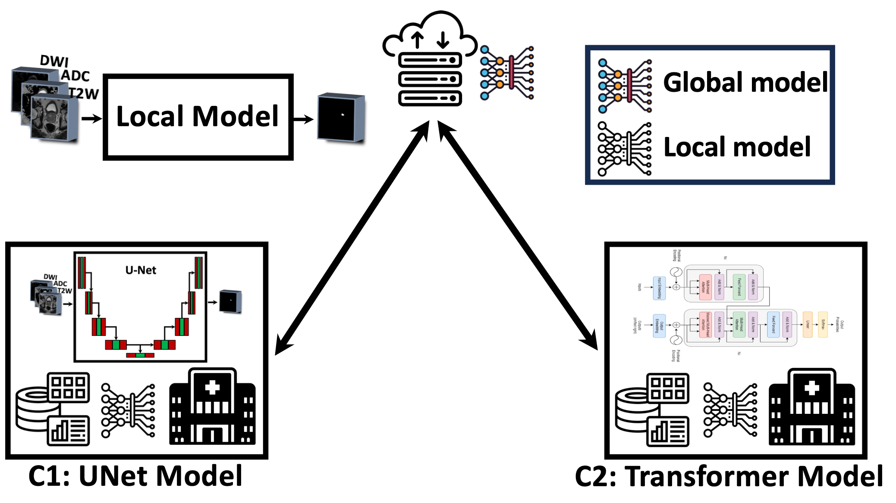
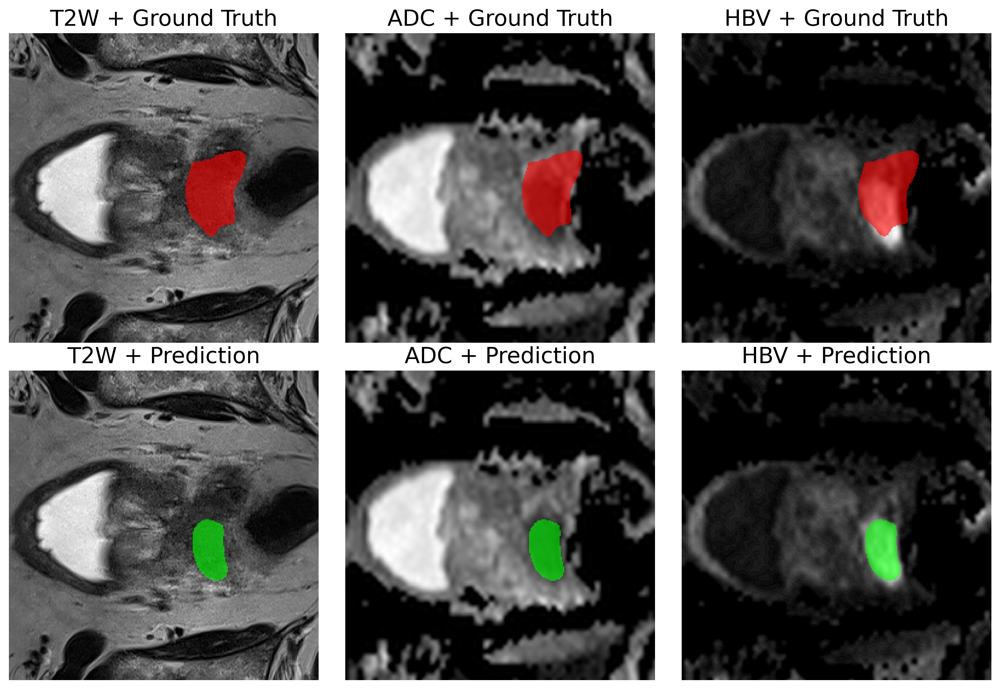
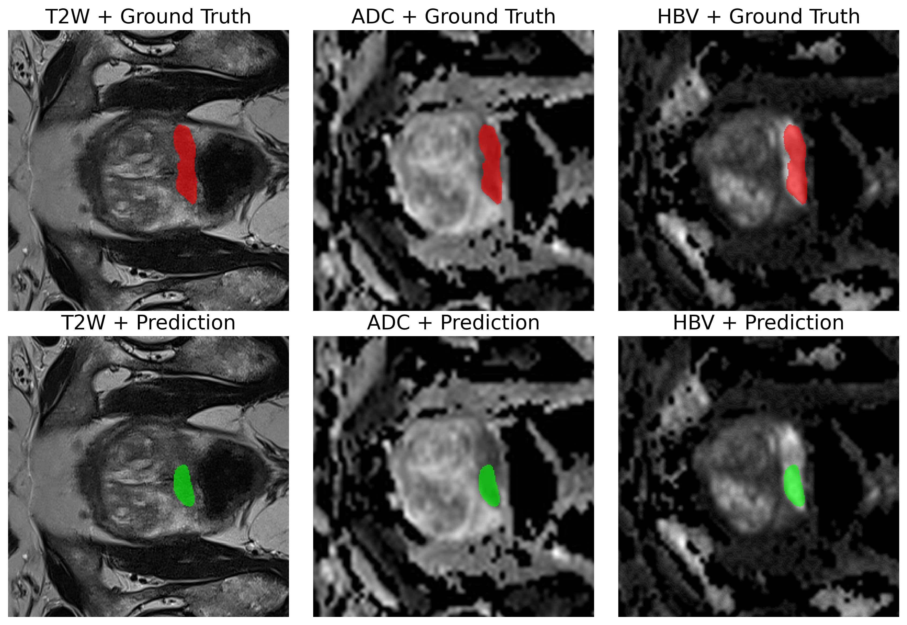

# Impact of Local Model Design on Prostate Cancer Detection with Federated Learning

This study proposes a **federated learning (FL) solution** for detecting clinically significant prostate cancer (csPCa) on biparametric MRI data (T2W, HBV, and ADC) using data from the [PI-CAI (Prostate Imaging: Cancer AI) grand challenge](https://pi-cai.grand-challenge.org/). More specifically, we investigate the impact of **local model architecture** on the performance of FL for csPCa detection.

<p align="center">
  
</p>

To this end, we initially implement the **non-FL solutions** (including local and centralized model training) for csPCa detection using convolutional neural networks (CNNs) including **[nnU-Net](https://github.com/MIC-DKFZ/nnUNet)** and **Dynamic UNet on [MONAI](https://github.com/Project-MONAI)**, and transformer-based model architectures including **[UNETR](https://arxiv.org/abs/2103.10504)** and **[SwinUNETR](https://arxiv.org/abs/2201.01266)**. In the centralized model trainig the data from all clients is collected in a single location. Then we propose the **FL solution** for each scenario, implemented using **[Flower](https://flower.ai/)** FL. Finally, we conclude the work by comparing the prediction performance of the different models for locating csPCa in bpMRI data.

<p align="center">
  
</p>

<p align="center">
  
</p>

## Data pre-paration and pre-processing

Before starting the experiments, make sure that your dataset is downloaded and organized in the following format.

```
workdir/  
├── nnUNet_raw/  
│   └── Dataset104_picai/  
│       ├── imagesTr/  
│       ├── labelsTr/  
│       ├── dataset.json
│       └── dataset_unetr.json
├── nnUNet_preprocessed/  
└── nnUNet_results/  
```

The `dataset.json` file is used for the nnUNet experiments and is:

```json
{
    "channel_names": {
        "0": "T2W",
        "1": "ADC",
        "2": "HBV"
    },
    "labels": {
        "background": 0,
        "lesion": 1
    },
    "numTraining": 1500,
    "file_ending": ".nii.gz",
    "name": "picai_nnunetv2",
    "reference": "none",
    "release": "1.0",
    "description": "bpMRI scans from PI-CAI dataset to train by nnUNetv2",
    "overwrite_image_reader_writer": "SimpleITKIO"
}
```
The `dataset_unetr.json` file is used for the tranformer-based and DynUNet experiments and is:

```json
{
    "channel_names": {
        "0": "T2W",
        "1": "ADC",
        "2": "HBV"
    },
    "labels": {
        "background": 0,
        "lesion": 1
    },
    "numTraining": 1200,
    "file_ending": ".nii.gz",
    "name": "picai_nnunetv2",
    "reference": "none",
    "release": "1.0",
    "description": "bpMRI scans from PI-CAI dataset to train by nnUNetv2",
    "overwrite_image_reader_writer": "SimpleITKIO",
    "training": [
        {
            "image": [
                "./imagesTr/10000_1000000_0000.nii.gz",
                "./imagesTr/10000_1000000_0001.nii.gz",
                "./imagesTr/10000_1000000_0002.nii.gz"
            ],
            "label": "./labelsTr/10000_1000000.nii.gz"
        }
    ],
    "validation": [
        {
            "image": [
                "./imagesTr/10015_1000015_0000.nii.gz",
                "./imagesTr/10015_1000015_0001.nii.gz",
                "./imagesTr/10015_1000015_0002.nii.gz"
            ],
            "label": "./labelsTr/10015_1000015.nii.gz"
        }
    ]
}
```

## CNN: nnUNetV2 model training

**Preprocessing:** This step runs the preprocessing and ensures the integrity of the prepared dataset before starting the nnUNet training (used nnunetv2-2.6.0).

```bash
nnUNetv2_plan_and_preprocess -d 101 -c 3d_fullres --verify_dataset_integrity
```

**Training:** Subsequently, we can train the nnUNet model for the desired number of epochs using 5-fold cross-validation.

```bash
for FOLD in 0 1 2 3 4; do
    nnUNetv2_train Dataset101_picai 3d_fullres "$FOLD" \
        -tr nnUNetTrainerCELoss_1000epochs --npz
done
```

## CNN: DynUnet model training
The scripts for model training for the `DynUNet` model architecture are provided in `./cnn_nnunet_monai`, where the model training with the desired parameters can be run as:
```bash
python monai_dynunet.py \
    --datasets_json ./nnUNet_raw/Dataset101_picai/dataset_unetr.json \
    --root_dir ./workdir \
    --num_train 1000 \
    --num_val 300 \
    --max_iterations 300 \
    --batch_size 2 \
    --eval_num 5
```

## Transformer: UNETR and SwinUNETR model training
Similarly, the scripts for model training for the `UNETR` and `SwinUNETR` model architectures are provided in `./transformers_unetr_swinunetr`, where the model training with the desired parameters can be run as:

```bash
python swinunetr_train.py \
    --datasets_json ./workdir/dataset.json \
    --root_dir ./workdir \
    --num_train 100 \
    --num_val 20 \
    --max_iterations 5 \
    --batch_size 1 \
    --eval_num 1
```

# A Flower / PyTorch app: 

Install dependencies and project (`swinunetr-fl`) as

```bash
cd ./flower/swinunetr-fl
pip install -e .
```

In the `swinunetr-fl` directory, use `flwr run` to run a local simulation:

```bash
flwr run .
```
Refer to the [How to Run Simulations](https://flower.ai/docs/framework/how-to-run-simulations.html) guide in the Flower documentation for advice on how to optimize your simulations. The different parts of the application, such as `client_app.py`, `new_strategy.py`, `server_app.py`, and `task.py`, can be updated if you want to adapt the application to your own task or dataset. Similarly, the Flower application for the scenario using the `DynUNet` local model for clients is provided in the `dynunet-fl` folder. With a simple tweak, a new application with a customized model architecture can also be implemented. Please note that implementing a customized aggregation strategy is also possible by updating the strategy file. In Flower, the local model architecture is assigned by the server, which is determined by the first client connected to the federation.


## 📖 Citation
The method was developed at the [CIMORe](https://www.ntnu.edu/isb/mr-cancer) - Cancer Imaging and Multi-Omics Research Group at the Norwegian University of Science and Technology (NTNU) in Trondheim, Norway. If you use this work, please cite:

```bibtex
@article{moradi2025optimizing,
  title={Optimizing Federated Learning Configurations for MRI Prostate Segmentation and Cancer Detection: A Simulation Study},
  author={Moradi, Ashkan and Zerka, Fadila and Bosma, Joeran Sander and Sunoqrot, Mohammed RS and Abrahamsen, Bendik S and Yakar, Derya and Geerdink, Jeroen and Huisman, Henkjan and Bathen, Tone Frost and Elschot, Mattijs},
  journal={Radiology: Artificial Intelligence},
  pages={e240485},
  year={2025},
  publisher={Radiological Society of North America}
}
```